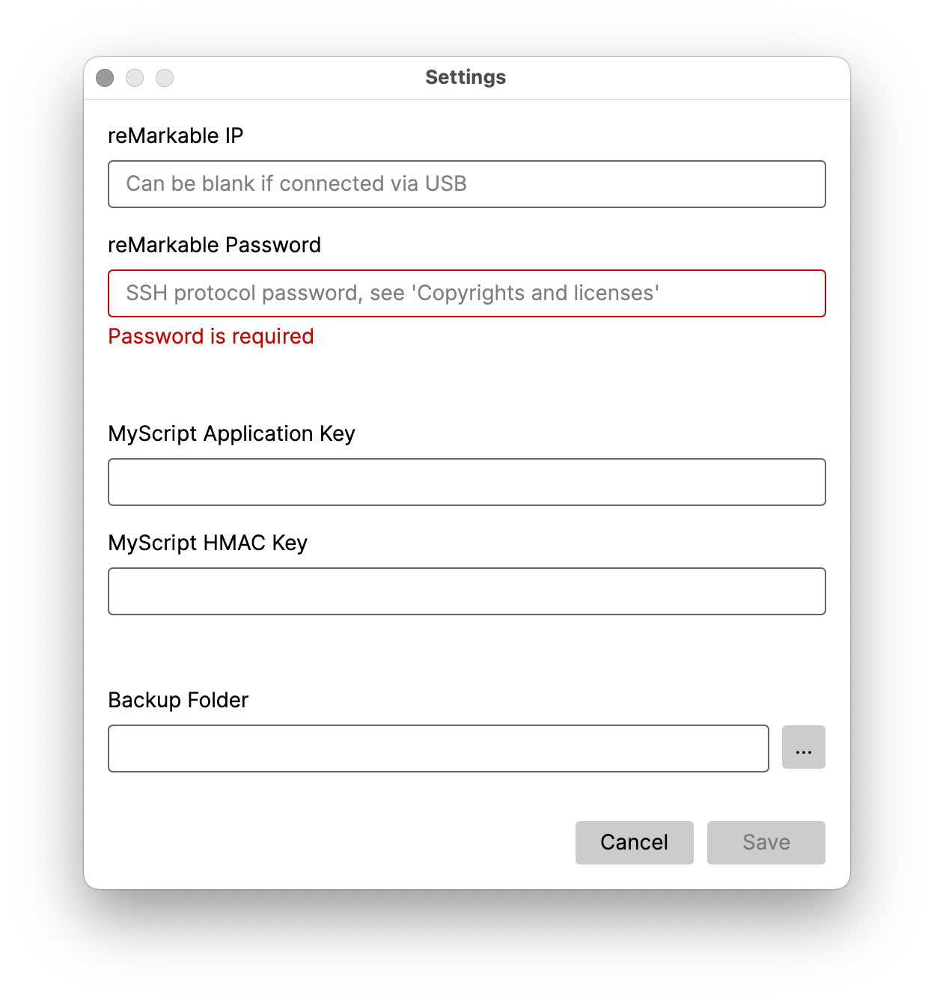
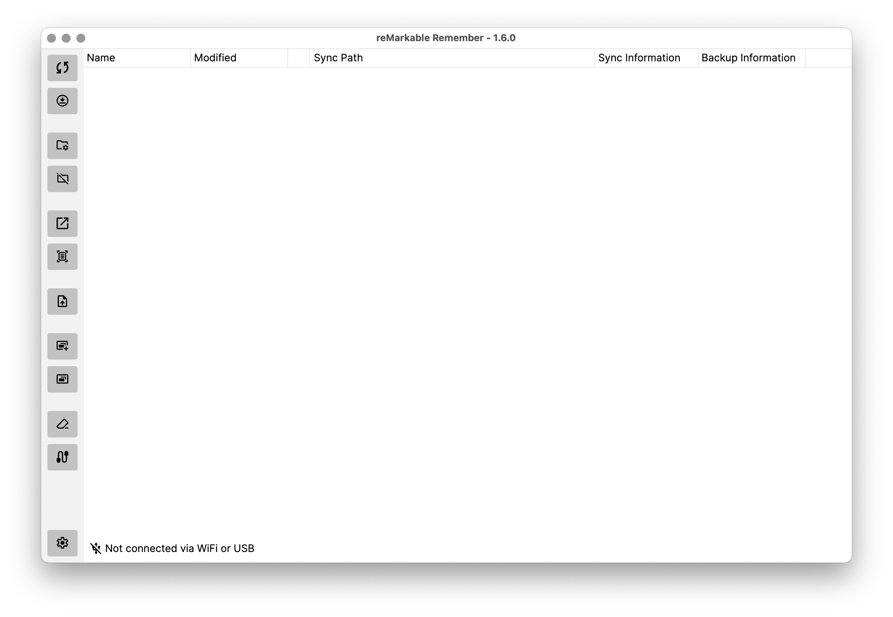
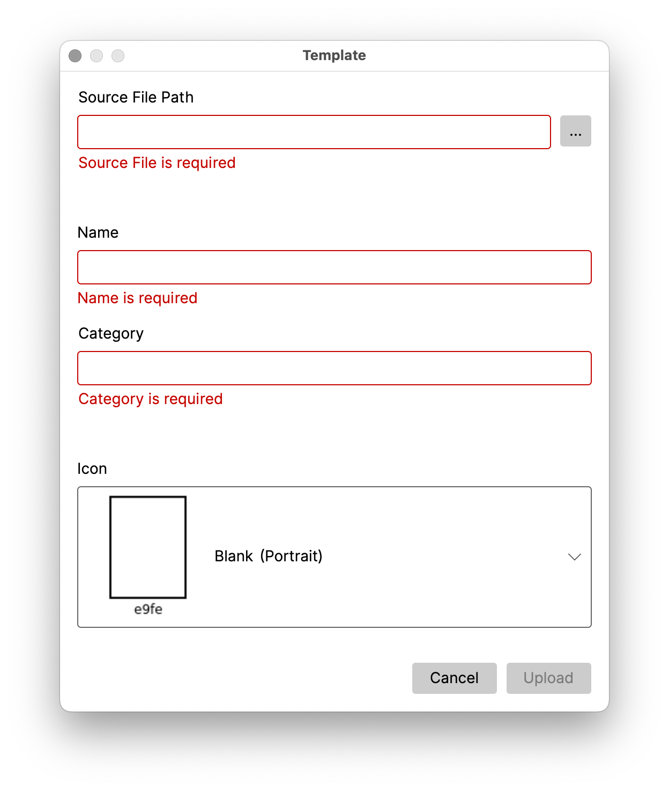

# reMarkable Remember

The application is a cross-platform management tool for your reMarkable tablet. No reMarkable account or subscription is required.

## Features

- Connect your reMarkable tablet via WiFi or USB
- Sync PDF documents via USB
- Upload PDFs and EPUBs via USB
- Backup notebooks and folders
- Template management
- Handwriting recognition via MyScript
- Install [Lamy Eraser](https://github.com/isaacwisdom/RemarkableLamyEraser/tree/v1) and [WebInterface-OnBoot](https://github.com/rM-self-serve/webinterface-onboot) via WiFi or USB

## Installation

The application is available for Linux, MacOS, and Windows. Executables and setups can be found under [Releases](https://github.com/ds160/remarkable-remember/releases).

## Settings

For the initial setup, enter your reMarkable SSH protocol information. You find the information at the bottom of the Copyrights notices and software licenses page. Navigate to `Menu` > `Settings` > `General` > `Help` > `About` > `Copyrights and licenses`. If you connect your reMarkable tablet via USB, the IP can be left blank; only the password is required.

You need a [MyScript](https://developer.myscript.com/getting-started/web) account for handwriting recognition. Register to receive your keys and enter your keys.

Set the folder if you want to back up your notebooks and folders.

## Usage

Connect your reMarkable tablet via USB for full functionality and activate the `USB web interface` for downloading PDF documents. Navigate to `Menu` > `Settings` > `Storage` and enable the feature. Optionally, you can use the [WebInterface-OnBoot](https://github.com/rM-self-serve/webinterface-onboot) program to eliminate the need to switch on the `USB web interface` setting after connecting the USB cable.

If you connect your reMarkable tablet via WiFi most functions work, but downloading PDFs and uploading PDFs and EPUBs are not supported.

The items are refreshed every 10 seconds when your tablet is connected. Select an item and configure the target directory for downloading and syncing folders and documents.

You can upload custom templates to your reMarkable. Buy, download, or design your own template (see [here](https://github.com/reHackable/awesome-reMarkable/blob/master/README.md#custom-templates)). To upload a template, select the file, define the name and category, and select the desired icon. The application will restart your reMarkable tablet automatically to enable the template.

## Build

Clone the repository, install .NET Core SDK 8, and build the project with `dotnet build`.

## Dependencies and Acknowledgment

- I'm using [Avalonia](https://github.com/AvaloniaUI/Avalonia) for the UI, [NLog](https://github.com/NLog/NLog) for logging and [SSH.NET](https://github.com/sshnet/SSH.NET) for the SFTP and SSH communication.
- I got inspired by [rmscene](https://github.com/ricklupton/rmscene) to parse the reMarkable Lines File (version 6) and do handwriting recognition via MyScript.
- I'm using the [Lamy Eraser](https://github.com/isaacwisdom/RemarkableLamyEraser/tree/v1) sources that turns the button on the Lamy Pen into an eraser on the reMarkable tablet.
- I'm using the [WebInterface-OnBoot](https://github.com/rM-self-serve/webinterface-onboot) sources that eliminates the need to switch on the `USB web interface` setting after connecting the USB cable.
- I'm using [PupNet Deploy](https://github.com/kuiperzone/PupNet-Deploy) for the deployment. 

Thanks to the developers for their beautiful work.

## Links

- [Awesome reMarkable](https://github.com/reHackable/awesome-reMarkable)
- [Information about reMarkable 2](https://remarkable.jms1.info/)
