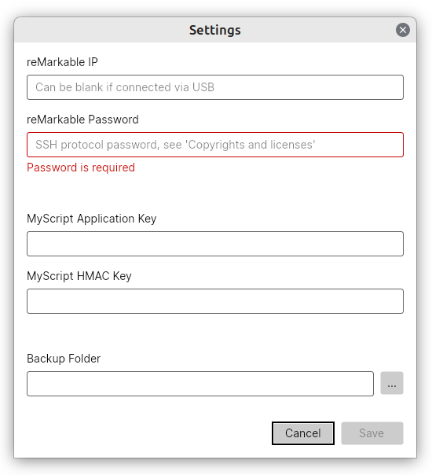

# reMarkable Remember

The application is a cross-platform managenment tool for your reMarkable tablet. No reMarkable account or subscription required.

## Features

- Connect your reMarkable tablet via WiFi or USB
- Sync PDF documents via USB
- Backup notebooks and folders
- Upload of templates
- Hand writing recognition via MyScript

## Installation

The application is available for Windows, Linux, and OSX. Executables are available under [Releases](https://github.com/ds160/remarkable-remember/releases).

## Settings

For the initial setup, enter your reMarkable SSH protocol information. You find the information at the bottom of the Copyrights notices and software licenses page. Navigate to `Menu` > `Settings` > `Help` > `Copyrights and licenses`. If you connect your reMarkable tablet via USB, the IP can be blank.

You need a [MyScript](https://developer.myscript.com/getting-started/web) account for hand writing recognition. Register to receive your keys and enter your keys.

Set the folder if you want to back up your notebooks and folders.

## Usage

Connect your reMarkable tablet via USB for full functionality and activate the `USB web interface` for downloading PDF documents. Navigate to `Menu` > `Settings` > `Storage` and enable the feature.

If you connect your reMarkable tablet via WiFi almost everything is supported, but downloading PDF documents is not working.

Refresh items when your tablet is connected. Select an item and configure the target directory for downloading and syncing folders and documents.

You can upload custom templates to your reMarkable. Buy, download, or design your own template (see [here](https://github.com/reHackable/awesome-reMarkable/blob/master/README.md#custom-templates)). To upload a template, select the file, define the name and category and select the desired icon. The application will restart your reMarkable tablet automatically to enable the template.

## Build

Clone the repository, install .NET Core SDK 7 or higher, and build the project with `dotnet build`.

## To-Do

- [ ] Automatic refresh of items
- [ ] Template Management (Save to database, Restore, Delete)
- [ ] ...

## Dependencies and Acknowledgment

I'm using [Avalonia](https://github.com/AvaloniaUI/Avalonia) for the UI and [SSH.NET](https://github.com/sshnet/SSH.NET) for the SFTP and SSH communication.

Thanks to the developers for their beautiful work.

## Links

- [Awesome reMarkable](https://github.com/reHackable/awesome-reMarkable/blob/master/README.md)
- [Lamy Pen](https://github.com/isaacwisdom/RemarkableLamyEraser)
- [Lines File, Version 6](https://github.com/ricklupton/rmscene)
- [Toltec](https://toltec-dev.org/)
